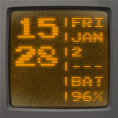

CRT Watch Face
=====================

Watch Face for SmartQ Z Smartwatch with a retro mini CRT screen look. It shows day, date and battery status as well. The numerals/alphabets are interlaced and there is a glow added to them for a more authentic look

Screenshot
----------

Installation
------------
Connect your Smartwatch, enable developer options (tapping Model Number 5 times under Settings->About). After installing Android SDK, go to `platform-tools` and check if the smartwatch is being shown :

    $ ./adb devices
    List of devices attached
    Indroid device
    
    $ ./adb install crtwatchface.apk
    ...
    Success
    
After the installation is complete, the watch launcher will refresh and you will have the option to choose your new watchface :) Wait for a little while for the time and date to get displayed.

TODOs
-----
* Multiple color CRTs
* Maybe, something below the time display

Credits
-------
1. [Cool-retro-term](https://github.com/Swordfish90/cool-retro-term) project for the CRT border and ideas